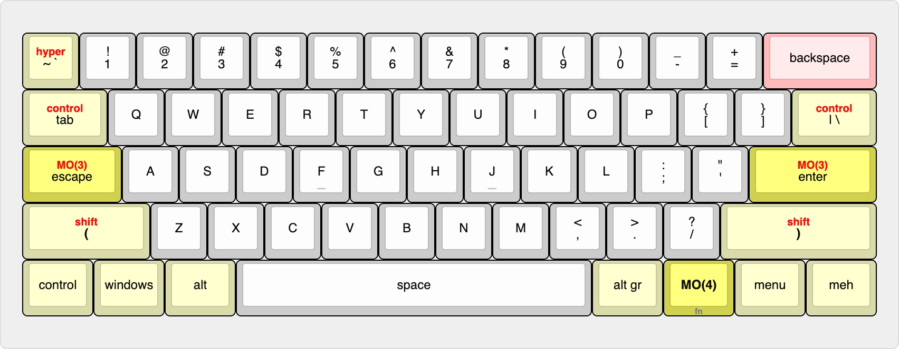
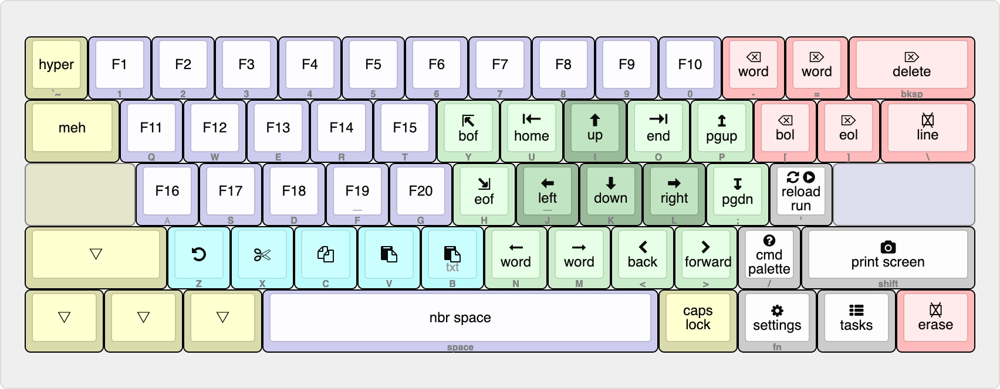
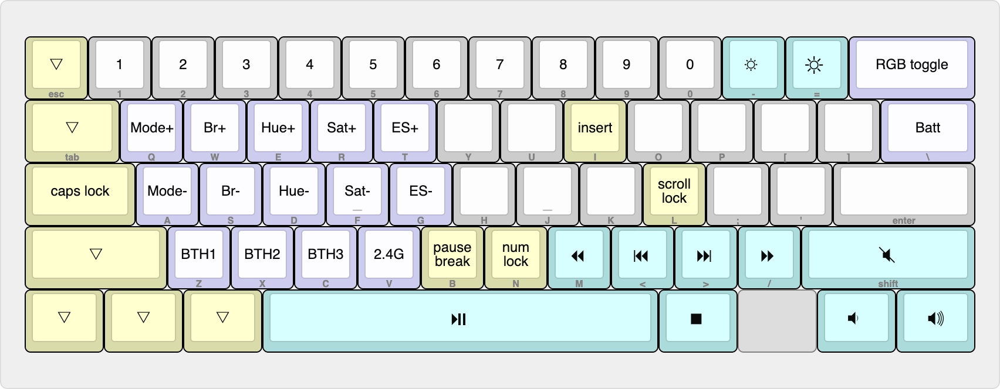

# YASL — Yet Another 60% Layout

## Intro

I believe a 60% keyboard is the best compromise between ergonomics, compactness, and the learning curve required to switch layouts.

After many months of searching and extensive (and sometimes tiring) testing of various layouts, I developed one that I find comfortable to use on both external keyboards and the MacBook’s built‑in keyboard.

My goals were:
- Minimize the number of layers — I believe everything you really need for work can fit on two layers.
- Make the layout usable on a MacBook keyboard using Karabiner‑Elements.

## The layout

### Mac and Windows 1st layer

### Mac/Windows 2nd layer

### Common 3rd layer

## Karabiner implementation

There is no `right_control` key on the MacBook's keyboard, making it ideal for use as a layer modifier. So the first step is to replace `caps_lock` on hold and `return` on hold with `right_control`, and then to remap various `right_control+key` combinations to the target keys.  [Here](../karabiner) you can find final [configuration file](../karabiner/karabiner.json) for Karabiner-Elements.
